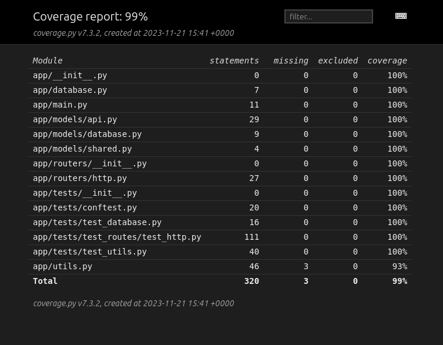
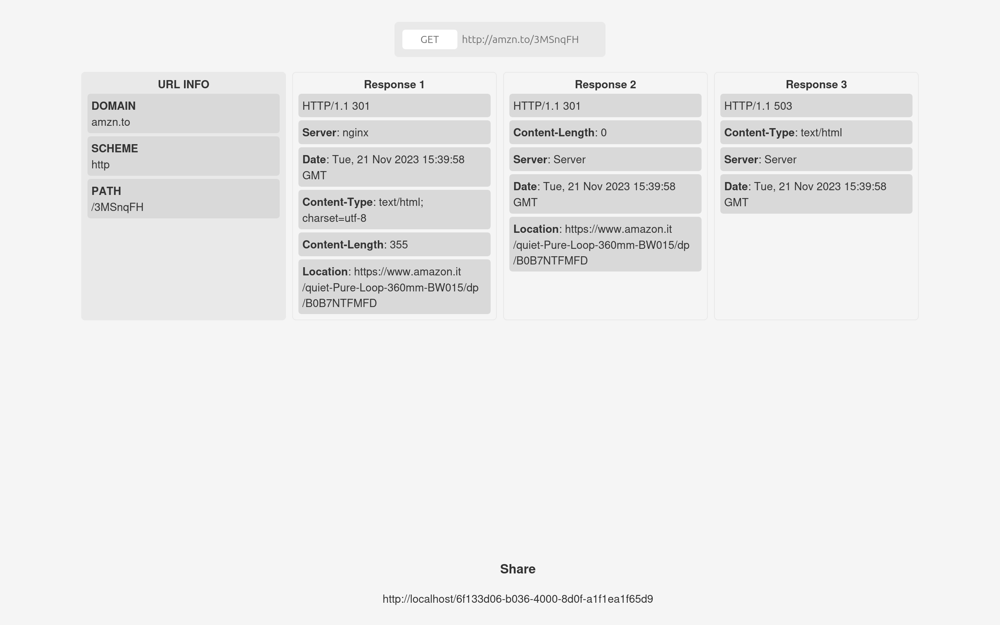

# Curl-as-a-Service

## Project Overview

Curl-as-a-Service is a web application that allows users to create HTTP requests and analyze the responses, providing information on URL analysis. The application saves all requests and their corresponding responses in a database, and the data can be browsed through a page that takes the request ID from the URL.







## Getting Started

1) ### Install the Required Software
   Install [Docker](https://docs.docker.com/get-docker/) and [Docker Compose](https://docs.docker.com/compose/install/), if you haven't already.

2) ### Navigate into the Project Directory
   ```bash
   cd digitiamo
   ```

3) ### Initialize the Environment Variables
   Copy the .env.example file to a new file named .env and modify the environment variables if necessary.
   ```bash
   cp .env.example .env
   ```

4) ### Edit the docker-compose.yml File
   Edit the `docker-compose.yml` file to remove mongo-express, a tool for visualizing the database, if not needed, or to avoid exposing it externally.

5) ### Start the Application
   ```bash
   docker compose up -d
   ```
   This command starts the application in the background. To view the logs, run:
   ```bash
   docker compose logs -f
   ```
   To stop the application, run:
   ```bash
   docker compose down
   ```
   To run tests, execute:
   ```bash
   docker exec -it digitiamo-server-1 python -m pytest -vv
   ```
   To run the coverage report, execute:
   ```bash
   docker exec -it digitiamo-server-1 python -m pytest --cov app --cov-report html:app/htmlcov
   python -m http.server -d app/htmlcov
   ```
   Then open the browser at http://localhost:8000 to view the report.

   To run the linter, execute:
   ```bash
   docker exec -it digitiamo-server-1 pylint --disable=W0621 /code/app/
   ```

## Project Architecture

Curl-as-a-Service relies on Docker and Docker Compose for the development and production environment. The project consists of 4 containers:
- `digitiamo-server-1`: contains the FastAPI server handling API endpoints
- `digitiamo-mongo-1`: contains the MongoDB database where requests and responses are stored
- `digitiamo-mongo-express-1`: contains `mongo-express`, a tool for visualizing the database
- `digitiamo-webserver-1`: contains an Nginx web server serving static files, acting as a reverse proxy for the FastAPI server, and handling rate limiting for API endpoints

## API Documentation

The API documentation is available at http://localhost/docs, allowing API testing directly from the browser. Alternatively, [Postman](https://www.postman.com/) or [Insomnia](https://insomnia.rest) can be used to test the APIs. The `openapi.json` file containing API documentation in JSON format is available at http://localhost/openapi.json.

## Security

The application is protected by a rate-limiting system that restricts the number of requests that can be made within a certain time interval. Rate limiting is set to 100 requests every 60 seconds per IP address and is managed by the Nginx web server.

To prevent potentially harmful [Server Side Request Forgery (SSRF)](https://owasp.org/www-community/attacks/Server_Side_Request_Forgery) attacks in the Cloud environment, the application verifies at each step whether a domain points to a private IP address and blocks the request if necessary.

The test suite includes tests for common SSRF attacks as well as generic attacks like infinite redirects. Future developments may include protection against [DNS Rebinding](https://www.paloaltonetworks.com/cyberpedia/what-is-dns-rebinding) and [DNS Cache Poisoning](https://www.cloudflare.com/it-it/learning/dns/dns-cache-poisoning/).